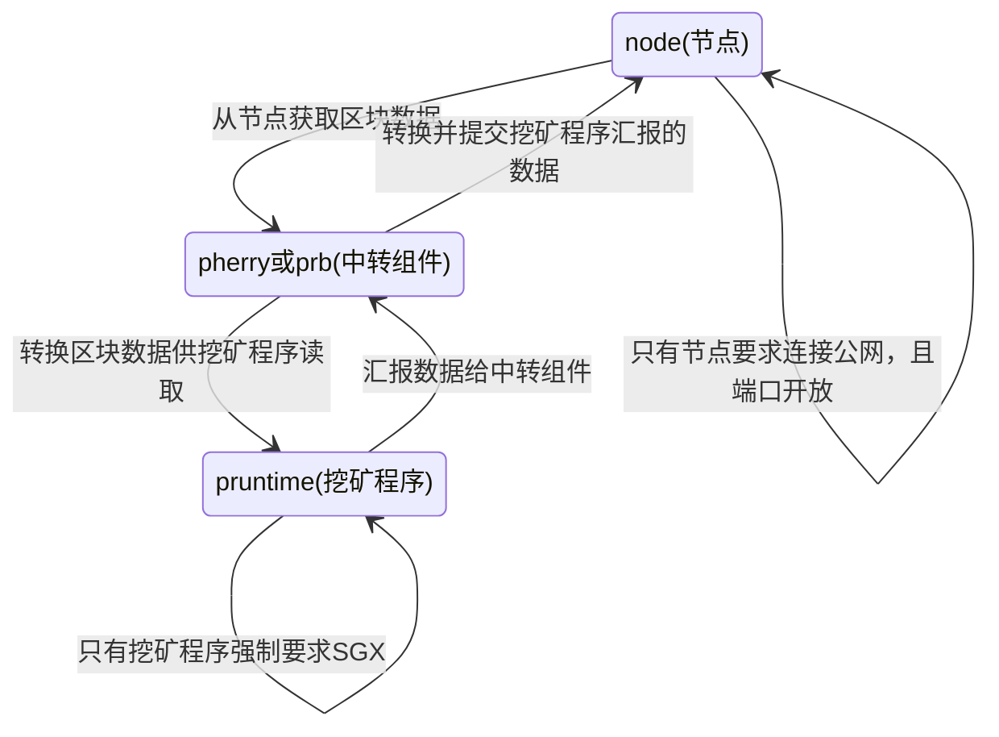

↖目录点这个图标 ⁝☰

# Phala 矿工指导

---

**本指导目的是简单描述挖矿套件的工作原理，并提供一些我的总结经验，帮助大家更好地加入 Phala 隐私计算的世界。**

将下述 RPC 命令统合起来的 shell 脚本 [phala_status.sh](./phala_status.sh)

1. 下载脚本（已下载的可跳过）
```
wget https://raw.githubusercontent.com/zozyo/phala-guide/main/phala_status.sh -O phala_status.sh
```

2. 添加脚本运行权限
```
sudo chmod +x phala_status.sh
```

3. 运行脚本
```
sudo ./phala_status.sh
```

此脚本只是做个简单的应用示范，只需要端口能通就可以显示状态，可以在其他机器上使用。

---

## 各组件的功能与要求

首先，挖矿分为三个必须组件，如图所示：



接下来将从上至下介绍各个组件的需求。

### 1. node (节点)

目前节点区块数据大小为 **887 GB**，其中 khala 链数据 **114G**，kusama 链数据 **774G**，统计时间为 **2022/4/13**

节点数据默认保存地点为 `/var/khala-dev-node`，其中 khala 链数据保存在 `chains` 子文件夹下，kusama 链数据保存在 `polkadot` 子文件夹下。

鉴于目前的数据增速，建议使用 **2T 以上**的硬盘存放节点区块数据。使用 SSD，**特别是 NVME 的 SSD**，可以使 pruntime 挖矿程序获得比 HDD 更快的同步速度。

节点会占用一部分 CPU 资源，和挖矿程序放在同一台机器上会导致机器的 CPU 评分有所下降。如果有条件的建议将 node 分离运行。[分离运行的方法](./node-separation.md)

---

这里提供 node 的 RPC 接口的几个常用的查询状态的 shell 命令，可以做成 shell 脚本来监控 node 运行状况。

其中 `localhost` 可以替换为所使用的机器的 IP。比如分离节点后，节点机所使用的 IP 为 `10.0.0.1`，则把 `localhost` 替换为 `10.0.0.1`

冒号后面的 `9933` 为端口号，其中 `9933` 为 khala 链节点的端口号，`9934` 为 kusama 链节点的端口号。

使用 `9933` 端口获取到的结果是 khala 链节点的状态，使用 `9934` 端口获取到的结果是 kusama 链节点的状态。

* #### 查询节点健康状态

```
curl -sH "Content-Type: application/json" -d '{"id":1, "jsonrpc":"2.0", "method": "system_health", "params":[]}' http://localhost:9933 | jq '.result'
```

获取到的结果如下

```
{
  "isSyncing": false,
  "peers": 50,
  "shouldHavePeers": true
}
```

其中主要关心两个结果：

`isSyncing` 代表节点是否在同步中的状态，如果 `peers` 不为 `0` 的状态下，为 `false` 并不是没在同步，而是代表同步完成。

`peers` 代表节点的对等点的数量，上限为 `50`，如果为 `0` 请检查网络是否畅通或者端口是否开放。

* #### 查询节点的版本号

```
curl -sH "Content-Type: application/json" -d '{"id":1, "jsonrpc":"2.0", "method": "system_version", "params":[]}' http://localhost:9933 | jq '.result'
```

获取到的结果如下

```
"0.1.11-pre-1451575-x86_64-linux-gnu"
```

其中只要关心最前面的数字即可，**截至 2022/4/14, 最新的版本号为 0.1.13**

* #### 查询节点的区块高度

```
curl -sH "Content-Type: application/json" -d '{"id":1, "jsonrpc":"2.0", "method": "system_syncState", "params":[]}' http://localhost:9933 | jq '.result'
```

获取到的结果如下

```
{
  "currentBlock": 1299812,
  "highestBlock": 1299813,
  "startingBlock": 1272048
}
```

其中：

`currentBlock` 代表节点已同步到的**当前高度**，同步完成后，正常状态下该值与最高高度应该差距在 2 以内。

`highestBlock` 代表节点所获取到的链**最高高度**，同步完成后，正常状态下该值与当前高度应该差距在 2 以内。

`startingBlock` 代表节点本次启动的区块高度，重启节点会更新该值到节点最新高度。

**注意！如果出现卡链情况，获取到的最高高度可能不会更新，实际最高高度以公共RPC的最高高度为准！**

查询链高度的公共RPC地址：https://polkadot.js.org/apps/?rpc=wss%3A%2F%2Fkhala.api.onfinality.io%2Fpublic-ws#/explorer

### 2. pherry或prb (中转组件)

中转组件是一个无状态的转换机，只起到传话筒的作用。重启中转组件只会导致很短暂的 pruntime 的暂停同步。

有时官方可能会有链上升级，会有通知重启中转组件，建议保持关注官方的技术交流群，以免造成损失。

pherry 可以不在 SGX 机器上运行。

### 3. pruntime（挖矿程序）

pruntime（挖矿程序）作为最关键的组件，必须在支持 SGX 的设备上运行，并且 `phala config set` 命令里面唯一对其生效的参数只有**核心数量**。

运行 pruntime 并且链上开始挖矿时，会有 `./app` 的程序占用 100% 的 CPU，这是正常情况。

PHA 挖矿需要满负载 CPU， 建议设备使用较好的散热器以获得高评分。

---

这里提供 pruntime 的 RPC 接口查询状态的 shell 命令，可以做成 shell 脚本来监控 pruntime 运行状况。

其中 `localhost` 可以替换为所使用的机器的 IP。比如分离节点后，矿机所使用的 IP 为 `10.0.0.1`，则把 `localhost` 替换为 `10.0.0.1`

```
curl -X POST -sH "Content-Type: application/json" -d '{"input": {}, "nonce": {}}' http://localhost:8000/get_info | jq '.payload|fromjson'
```
获取到的结果如下

```
{
  "blocknum": 1299869,
  "dev_mode": false,
  "ecdh_public_key": "xxxxxxxxxxxxxxxxxxxxxxxxxxxxxxxxxxxxxxxxxxxxxxxxxxxxxxxxxxxxxxxx",
  "gatekeeper": {
    "master_public_key": "",
    "role": 0
  },
  "genesis_block_hash": "xxxxxxxxxxxxxxxxxxxxxxxxxxxxxxxxxxxxxxxxxxxxxxxxxxxxxxxxxxxxxxxx",
  "git_revision": "6a5114efa3cb9356089000447d114d9f1abdab4c",
  "headernum": 11530277,
  "initialized": true,
  "machine_id": "xxxxxxxxxxxxxxxxxxxxxxxxxxxxxxxx",
  "memory_usage": {
    "rust_peak_used": 123456789,
    "rust_used": 123456789,
    "total_peak_used": 123456789
  },
  "para_headernum": 1299869,
  "pending_messages": 0,
  "public_key": "xxxxxxxxxxxxxxxxxxxxxxxxxxxxxxxxxxxxxxxxxxxxxxxxxxxxxxxxxxxxxxxx",
  "registered": true,
  "running_side_tasks": 0,
  "score": 9999,
  "state_root": "xxxxxxxxxxxxxxxxxxxxxxxxxxxxxxxxxxxxxxxxxxxxxxxxxxxxxxxxxxxxxxxx",
  "version": "0.2.0"
}
```

其中
* `blocknum` 为 pruntime 目前同步到的 khala 链高度
* `headernum` 为 pruntime 目前同步到的 kusama 链高度
* `para_headernum` 为 pruntime 目前正在同步 khala 链的目标高度，同步过程中该值会比 `blocknum` 高几百。
* `public_key` 为本机器的公钥，用来给链上添加进矿池使用，**该公钥必须在同步完成后才能链上添加矿机，否则链上操作会失败。**
* `registered` 为机器是否已在链上注册的布尔值，为 `true` 代表可以进行链上添加操作
* `score` 为机器的本地评分，会与链上评分有一定差距，并且链上评分的更新会需要几个小时左右。刚注册完成的矿机能添加进矿池，但无法进行挖矿的原因大部分是因为链上评分尚未更新
* `version` 为 pruntime 的版本号，更新 pruntime 持久化功能前的最后一个版本为 `0.1.3`。**截至 2022/4/14 的最新版本为 `0.2.2`，有持久化功能**
