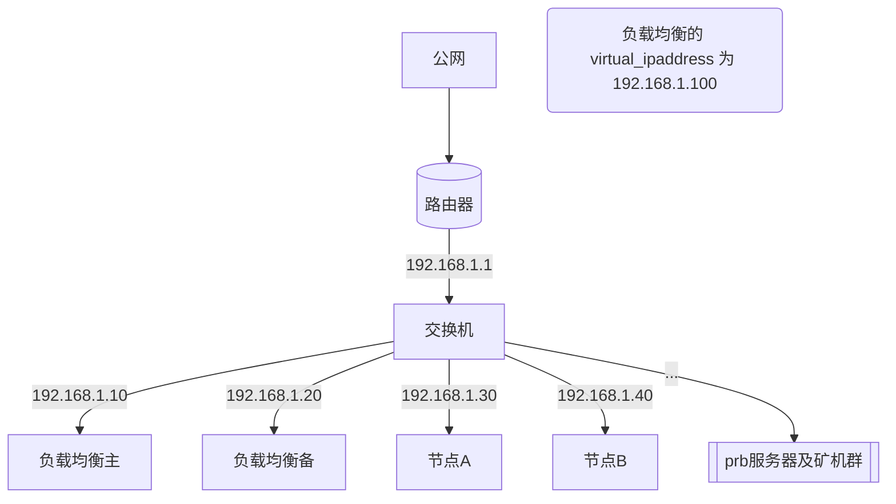

↖目录点这个图标 ⁝☰

# Phala 节点负载均衡配置示范

在大规模部署环境下，节点稳定性变得非常重要。这里给出一个简单的示范配置方法。

本示例使用 lvs + keepalived 的负载均衡方法，可以在不中断 node 的情况下部署，且配置简单。

方法其实有很多，比如 docker swarm 集群，以实际需求来决定，本文不展开。

示范使用的系统均为 Ubuntu Server 20.04 LTS，网口均为 eno1

*请根据实际需求增减配置*

## 设备要求

* 两台负载均衡服务器（一主一备）
  * 只做流量转发，不需要大硬盘
* 两台节点机
  * 需要大硬盘和公网连接，同时也要与两台负载均衡服务器处在同一个二层内网下

## 网络拓扑



* 路由器可以使用 VRRP 等高可用技术，本文不展开
* 路由器上需要做好端口映射，使节点能正常同步 || 节点机也可直接连接公网
* prb服务器及矿机群不需要与此负载均衡集群在同一个网段下，只要prb能正常访问到负载均衡的 virtual_ipaddress （本例为 192.168.1.100）即可。

## 配置方法

### 负载均衡主机

1. 安装 keepalived 并启用 IP 转发

```
apt install keepalived -y
echo "net.ipv4.ip_forward = 1" >> /etc/sysctl.conf
sysctl -p
```

2. 编辑配置 `/etc/keepalived/keepalived.conf`

```
global_defs {
   router_id b1
}

vrrp_instance VI_1 {
    state MASTER
    interface eno1
    virtual_router_id 66
    priority 100
    advert_int 1
    authentication {
        auth_type PASS
        auth_pass 12345678
    }
    virtual_ipaddress {
        192.168.1.100
    }
    unicast_src_ip 192.168.1.10
    unicast_peer {
        192.168.1.20
    }
}

virtual_server 192.168.1.100 9944 {
    delay_loop 5
    lb_algo wrr
    lb_kind DR
    protocol TCP

    real_server 192.168.1.30 9944 {
        weight 3
        TCP_CHECK {
            connect_port 9944
            connect_timeout 5
            retry 3
            delay_before_retry 3
        }
    }
    real_server 192.168.1.40 9944 {
        weight 3
        TCP_CHECK {
            connect_port 9944
            connect_timeout 5
            retry 3
            delay_before_retry 3
        }

    }
}

virtual_server 192.168.1.100 9945 {
    delay_loop 5
    lb_algo wrr
    lb_kind DR
    protocol TCP

    real_server 192.168.1.30 9945 {
        weight 3
        TCP_CHECK {
            connect_port 9945
            connect_timeout 5
            retry 3
            delay_before_retry 3
        }
    }
    real_server 192.168.1.40 9945 {
        weight 3
        TCP_CHECK {
            connect_port 9945
            connect_timeout 5
            retry 3
            delay_before_retry 3
        }

    }
}
```

3. 重启 keepalived 服务

```
systemctl restart keepalived
```

4. 检查状态

```
ipvsadm -Ln
```

应该会出现如下显示，代表配置完成

```
IP Virtual Server version 1.2.1 (size=4096)
Prot LocalAddress:Port Scheduler Flags
  -> RemoteAddress:Port           Forward Weight ActiveConn InActConn
TCP  192.168.1.100:9944 wrr
  -> 192.168.1.30:9944         Route   3      0         0
  -> 192.168.1.40:9944         Route   3      0         0
TCP  192.168.1.100:9945 wrr
  -> 192.168.1.30:9945         Route   3      0         0
  -> 192.168.1.40:9945         Route   3      0         0
```

### 负载均衡备机

1. 安装 keepalived 并启用 IP 转发

```
apt install keepalived -y
echo "net.ipv4.ip_forward = 1" >> /etc/sysctl.conf
sysctl -p
```

2. 编辑配置 `/etc/keepalived/keepalived.conf`

```
global_defs {
   router_id b2
}

vrrp_instance VI_1 {
    state BACKUP
    interface eno1
    virtual_router_id 66
    priority 90
    advert_int 1
    authentication {
        auth_type PASS
        auth_pass 12345678
    }
    virtual_ipaddress {
        192.168.1.100
    }
    unicast_src_ip 192.168.1.20
    unicast_peer {
        192.168.1.10
    }
}

virtual_server 192.168.1.100 9944 {
    delay_loop 5
    lb_algo wrr
    lb_kind DR
    protocol TCP

    real_server 192.168.1.30 9944 {
        weight 3
        TCP_CHECK {
            connect_port 9944
            connect_timeout 5
            retry 3
            delay_before_retry 3
        }
    }
    real_server 192.168.1.40 9944 {
        weight 3
        TCP_CHECK {
            connect_port 9944
            connect_timeout 5
            retry 3
            delay_before_retry 3
        }

    }
}

virtual_server 192.168.1.100 9945 {
    delay_loop 5
    lb_algo wrr
    lb_kind DR
    protocol TCP

    real_server 192.168.1.30 9945 {
        weight 3
        TCP_CHECK {
            connect_port 9945
            connect_timeout 5
            retry 3
            delay_before_retry 3
        }
    }
    real_server 192.168.1.40 9945 {
        weight 3
        TCP_CHECK {
            connect_port 9945
            connect_timeout 5
            retry 3
            delay_before_retry 3
        }

    }
}
```

3. 重启 keepalived 服务

```
systemctl restart keepalived
```

4. 检查状态

```
ipvsadm -Ln
```

应该会出现如下显示，代表配置完成

```
IP Virtual Server version 1.2.1 (size=4096)
Prot LocalAddress:Port Scheduler Flags
  -> RemoteAddress:Port           Forward Weight ActiveConn InActConn
TCP  192.168.1.100:9944 wrr
  -> 192.168.1.30:9944         Route   3      0         0
  -> 192.168.1.40:9944         Route   3      0         0
TCP  192.168.1.100:9945 wrr
  -> 192.168.1.30:9945         Route   3      0         0
  -> 192.168.1.40:9945         Route   3      0         0
```

### 节点机

运行此脚本即可 [vip.sh](./vip.sh)

下载脚本（已下载的可跳过）

```
wget https://raw.githubusercontent.com/zozyo/phala-guide/main/vip.sh -O vip.sh
```

添加脚本运行权限
```
sudo chmod +x node-auto-restart.sh
```

运行脚本
```
sudo ./node-auto-restart.sh
```
